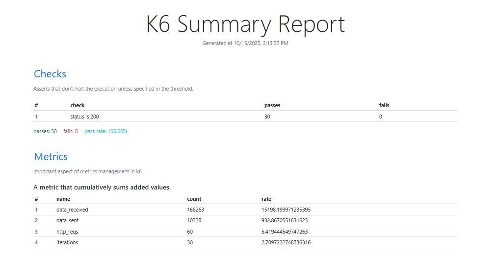

# 📊 k6 Load Testing Report

**Generated on:** October 15, 2025, 2:13:32 PM

This document presents the results of a load test executed using [k6](https://k6.io), a modern load testing tool. The goal of this test was to evaluate the performance and reliability of the target system under simulated load conditions.

---

## 🧪 Test Summary

### ✅ Assertions

The test included one assertion:

| # | Check           | Passes | Fails | Pass Rate |
|---|------------------|--------|--------|------------|
| 1 | Status is 200    | 30     | 0      | 100%       |

✔️ All checks passed successfully, indicating the system returned `200 OK` responses consistently.

---

## 📦 Metrics Overview

### 🔁 Cumulative Counters

These metrics show the total number of operations/events during the test:

| Metric         | Count   | Rate (per sec)         |
|----------------|---------|------------------------|
| data_received  | 168,263 | 15,198.20 bytes/sec    |
| data_sent      | 10,328  | 932.87 bytes/sec       |
| http_reqs      | 60      | 5.42 requests/sec      |
| iterations     | 30      | 2.71 iterations/sec    |

---

### 📈 Detailed Request Timings

These are calculated metrics, including averages, min, max, median, and percentiles.

| Metric                   | Avg       | Max        | Median    | Min       | P(90)     | P(95)     |
|--------------------------|-----------|------------|-----------|-----------|-----------|-----------|
| http_req_blocked         | 89.19 ms  | 1077.27 ms | 0.00 ms   | 0.00 ms   | 0.00 ms   | 1067.95 ms |
| http_req_connecting      | 27.61 ms  | 346.57 ms  | 0.00 ms   | 0.00 ms   | 0.00 ms   | 327.42 ms  |
| http_req_tls_handshaking | 56.60 ms  | 682.41 ms  | 0.00 ms   | 0.00 ms   | 0.00 ms   | 680.32 ms  |
| http_req_duration        | 330.84 ms | 345.74 ms  | 330.33 ms | 323.12 ms | 336.46 ms | 343.93 ms  |
| http_req_waiting         | 330.76 ms | 345.24 ms  | 330.19 ms | 323.12 ms | 336.40 ms | 343.93 ms  |
| http_req_receiving       | 0.06 ms   | 1.13 ms    | 0.00 ms   | 0.00 ms   | 0.00 ms   | 0.52 ms    |
| http_req_sending         | 0.03 ms   | 0.75 ms    | 0.00 ms   | 0.00 ms   | 0.00 ms   | 0.02 ms    |
| iteration_duration       | 1840.37 ms| 2748.06 ms | 1662.56 ms| 1650.69 ms| 2742.80 ms| 2745.30 ms |

---

## ❌ Failures

| Metric          | Fail Rate | Passes | Fails |
|-----------------|-----------|--------|--------|
| http_req_failed | 0%        | 0      | 60     |

✅ No request failures occurred during the test.

---

## 👥 Virtual Users

| Metric   | Min | Max | Value |
|----------|-----|-----|--------|
| vus      | 5   | 5   | 5      |
| vus_max  | 5   | 5   | 5      |

---

## 🖼️ Report Screenshots

Add your summary screenshots here for visual reference.

You can use the following Markdown to embed them:

### 📷 k6 Summary Report Screenshot

---

## 🧩 Interpretation & Insights

- All requests returned HTTP 200, showing good uptime and correctness under load.
- Request durations are consistent (~330ms), suggesting stable backend performance.
- No failed requests, indicating reliability.
- High blocking and TLS time spikes (up to 1s and 680ms respectively) could be worth investigating if latency is critical.
- Iteration durations peaked at ~2.7s, which might impact user experience at scale.

---

## 📚 Tooling Info

- **Tool:** [k6.io](https://k6.io)
- **Command Used:** (Add your k6 command here if needed)
- **Test Duration:** (Specify duration)

---

## 📌 Conclusion

The load test passed all assertions and showed stable performance under the simulated load. However, attention should be given to connection and TLS handshaking times for further optimization.
